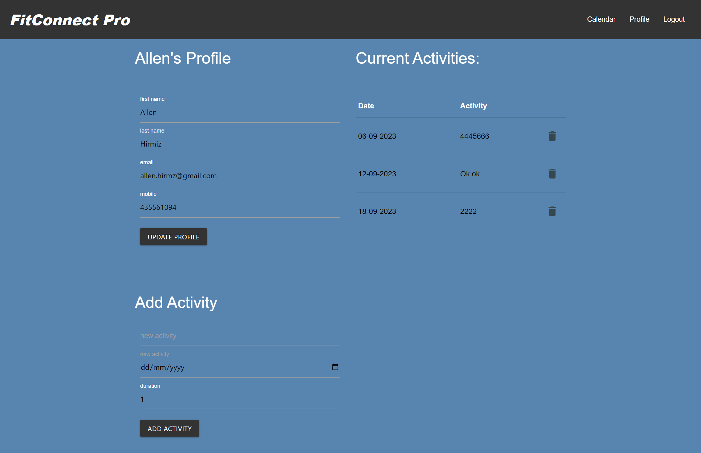

# FitConnect Pro - An Activity Tracker

## Description

FitConnect Pro is a web based website that allows their website users to keep track of their activities on daily basis.
The user will be require to sign up to the app to be able to use the Activity Tracker website free of charge.
Once signed up the user will be able to update their information and add their activities no matter if it was an old, new or future activity.
The user would have access to the following pages once logged in:
* Profile
* Calendar

Also they are able to sign out from the website by clicking on Sign Out button that is available on the website navigation bar.

## GitHub Repo URL
https://github.com/SHS-Peb/Fit-Connect-Pro

## Table of Contents
* [GitHub Repo URL](#github-repo-url)
* [Website URL on Heroku](#website-url-on-heroku)
* [Technologies Used](#technologies-used)
* [Main Page](#main-page)
* [Profile Page](#profile-page)
* [Calendar Page](#calendar-page)
* [Mobile Layout](#mobile-layout)

## Mock-Up

The following images shows the web application's appearance and functionality:

## Main Page

## Profile Page

## Calendar Page

## Mobile Layout

